# C++搜索引擎项目

## 代码

### epoll

#### client.cc

```c++
#include <unistd.h>
#include <stdio.h>
#include <string.h>
#include <errno.h>

#include <sys/types.h>
#include <sys/socket.h>
#include <netinet/in.h>
#include <arpa/inet.h>

#include <iostream>
#include <string>
using std::cin;
using std::cout;
using std::endl;
using std::string;
 
void test() 
{
	int clientfd = ::socket(AF_INET, SOCK_STREAM, 0);
	if(clientfd < 0) 
    {
		perror("socket");
		return ;
	}

	struct sockaddr_in serverAddr;
	memset(&serverAddr, 0, sizeof(serverAddr));
	serverAddr.sin_family = AF_INET;
	serverAddr.sin_port = htons(8888);
	serverAddr.sin_addr.s_addr = inet_addr("127.0.0.1");
	socklen_t length = sizeof(serverAddr);

	if(::connect(clientfd,(struct sockaddr*)&serverAddr, length) < 0) 
    {
		perror("connect");
		close(clientfd);
		return;
	}
	printf("conn has connected!...\n");

	while(1)
    {
		string line;
		getline(cin, line);
		cout << ">> pls input some message:";
		//1. 客户端先发数据
		send(clientfd, line.data(), line.size(), 0);

		char buff[128] = {0};
		recv(clientfd, buff, sizeof(buff), 0);
		printf("recv msg from server: %s\n", buff);
	}

	close(clientfd);
} 
 
int main(int argc, char *argv[])
{
	test();
	return 0;
}
```

#### server.cc

```c++
#include <stdio.h>
#include <stdlib.h>
#include <string.h>
#include <unistd.h>
#include <errno.h>
#include <sys/epoll.h>
#include <sys/types.h>
#include <sys/socket.h>
#include <arpa/inet.h>
#include <netinet/in.h>

#include <iostream>
#include <string>

using std::cin;
using std::cout;
using std::endl;
using std::string;

void test()
{
	//1. 创建监听服务器的套接字
	int listenfd = ::socket(AF_INET, SOCK_STREAM, 0);	
	if(listenfd < 0) 
    {
		perror("socket");
		return;
	}
    
    //地址复用
    int opt = 1;
    int ret = setsockopt(listenfd,  SOL_SOCKET, SO_REUSEADDR, &opt, sizeof(opt));
    if(-1 == ret)
    {
        perror("setsockopt ip error");
        close(listenfd);
        return;
    }

    //端口重用
    ret = setsockopt(listenfd, SOL_SOCKET, SO_REUSEPORT, &opt, sizeof(opt));
    if(-1 == ret)
    {
        perror("setsockopt port error");
        close(listenfd);
        return;
    }

	//网络地址需要采用网络字节序存储(大端模式)
	struct sockaddr_in serveraddr;
	memset(&serveraddr, 0, sizeof(serveraddr));
	serveraddr.sin_family = AF_INET;
	serveraddr.sin_port = htons(8888);
	serveraddr.sin_addr.s_addr = inet_addr("127.0.0.1");
	socklen_t length = sizeof(serveraddr);


	//2. 绑定服务器的网络地址
	if(::bind(listenfd, (struct sockaddr*)&serveraddr, length) < 0)
    {
		perror("bind");
		//文件描述符是比较稀缺的，所以不用的时候要回收
		close(listenfd);
		return;
	}

	//3. 让服务器开始监听
	// listenfd跟所有的新连接打交道
	if(::listen(listenfd, 128) < 0)
    {
		perror("listen");
		close(listenfd);
		return;
	} 
    cout << "server is listening..." << endl;

	// 创建epoll实例
	int efd = ::epoll_create1(0);// 红黑树 + 就绪链表

	struct epoll_event ev;
	ev.events = EPOLLIN | EPOLLOUT;
	ev.data.fd = listenfd;
	//epoll要进行监听操作: 对listenfd的读事件进行监听
    //
	//Reactor: 注册读就绪事件
	ret = ::epoll_ctl(efd, EPOLL_CTL_ADD, listenfd, &ev);
	if(ret < 0) 
    {
		perror("epoll_ctl");
		close(listenfd);
		close(efd);
		return;
	}

	struct epoll_event *evtList = 
        (struct epoll_event *)malloc(1024 * sizeof(struct epoll_event));

	//事件循环
	while(1)
    {
		//Reactor: 事件分离器
		int nready = ::epoll_wait(efd, evtList, 1024, 3000);
		if(-1 == nready && errno == EINTR)
        {
			continue;
        }
		else if(-1 == nready) 
        {
			perror("epoll_wait");
			return;
		} 
        else if(0 == nready) 
        {
			printf(">> epoll_wait timeout!\n");
		} 
        else
        {
			//遍历struct epoll_event数组, 去check
			//每一个epoll_event到底发生了什么事件
			for(int idx = 0; idx < nready; ++idx)
            {
				// 必须要使用按位&操作来判断事件，不能使用==,&&
				if((evtList[idx].data.fd == listenfd)  &&
				   (evtList[idx].events & EPOLLIN)) 
				{   
					//意味着有新连接来了,所以要调用accept函数,获取新连接
					//写事件什么情况会触发? 只要内核发送缓冲区还有空间，就可以触发写事件
					int peerfd = ::accept(listenfd, nullptr, nullptr);	
					/* TcpConnection conn(peerfd); */

					//将新连接添加到epoll的监听实例中去
					struct epoll_event ev;
					ev.events = EPOLLIN | EPOLLOUT | EPOLLERR;
					ev.data.fd = peerfd;
					ret = ::epoll_ctl(efd, EPOLL_CTL_ADD, peerfd, &ev);
					if(ret < 0) 
                    {
						perror("epoll_ctl");
						continue;
					}

					//新连接到来之后的处理
					printf(">> conn has connected, fd: %d\n", peerfd);
					//记录日志, 使用Log4cpp完成
					//个性定制化 ==> 事件处理器
					/* onConnection();//考虑扩展性，挖一个坑 */
				} 
                else
                {
					// 已经建立好的连接发送数据过来了
					// 如果发生了读事件
					char buff[128] = {0};
					if(evtList[idx].events & EPOLLIN)
                    {
						int fd = evtList[idx].data.fd;
						ret = ::recv(fd, buff, sizeof(buff), 0);

						if(ret > 0) 
                        {
							printf(">>> recv msg %d bytes,content:%s\n",
									ret, buff);
							
							//1. 对应用层数据进行解析
							//2. 拿到最终要处理的数据之后，进行业务逻辑处理
							//(假设第2步执行的时间很长1S, 是否合适)
							//3. 得到要返回给客户端的数据之后，进行发送操作
							//

							ret = send(fd, buff, strlen(buff), 0);
							printf(">>> send %d bytes\n", ret);
							/* onMessage();//, 考虑扩展性，挖一个坑 */
						}
                        else if(ret == 0)
                        {
							printf("conn has closed!\n");
							
							//需要从epoll的监听实例删除掉, 因为连接断开，不需要再监听了
							struct epoll_event ev;
							ev.data.fd = fd;
							ret = ::epoll_ctl(efd, EPOLL_CTL_DEL, fd, &ev);
							if(ret < 0) 
                            {
								perror("epoll_ctl");
							}
							//记录日志, log4cpp
							/* onClose();//考虑扩展性，挖一个坑 */
						}// end of ret if
					}//end of event if
					//else if()  //处理其他事件的
				}
			}
		}
    }
	
	close(listenfd);// 关闭连接
}
 
int main(int argc, char *argv[])
{
	test();
	return 0;
}
```

### ReactorV1

Acceptor.h

```c++
#ifndef __ACCEPTOR_H__
#define __ACCEPTOR_H__

#include "Socket.h"
#include "InetAddress.h"
#include <string>

using std::string;

class Acceptor
{
public:
    Acceptor(const string &ip, unsigned short port);
    ~Acceptor();
    void ready();
private:
    void setReuseAddr();
    void setReusePort();
    void bind();
    void listen();
public:
    int accept();
    int fd() const;

private:
    Socket _sock;
    InetAddress _addr;
};

#endif
```

Acceptor.cc

```c++
#include "Acceptor.h"
#include <stdio.h>

Acceptor::Acceptor(const string &ip, unsigned short port)
: _sock()
, _addr(ip, port)
{
}

Acceptor::~Acceptor()
{

}

void Acceptor::ready()
{
    setReuseAddr();
    setReusePort();
    bind();
    listen();
}

void Acceptor::setReuseAddr()
{
    int on = 1;
    int ret = setsockopt(_sock.fd(), SOL_SOCKET, SO_REUSEADDR, &on, sizeof(on));
    if(ret)
    {
        perror("setsockopt");
        return;
    }
}

void Acceptor::setReusePort()
{
    int on = 1;
    int ret = setsockopt(_sock.fd(), SOL_SOCKET, SO_REUSEPORT, &on, sizeof(on));
    if(-1 == ret)
    {
        perror("setsockopt");
        return;
    }
}

void Acceptor::bind()
{
    int ret = ::bind(_sock.fd(), 
                     (struct sockaddr *)_addr.getInetAddrPtr(),
                     sizeof(struct sockaddr));
    if(-1 == ret)
    {
        perror("bind");
        return;
    }
}

void Acceptor::listen()
{
    int ret = ::listen(_sock.fd(), 128);
    if(-1 == ret)
    {
        perror("listen");
        return;
    }
}

int Acceptor::accept()
{
    int connfd = ::accept(_sock.fd(), nullptr, nullptr);
    if(-1 == connfd)
    {
        perror("accept");
        return -1;
    }
    return connfd;
}

int Acceptor::fd() const
{
    return _sock.fd();
}
```

Socket.h

```c++
#ifndef __SOCKET_H__
#define __SOCKET_H__

#include "NonCopyable.h"

class Socket
: NonCopyable
{
public:
    Socket();
    explicit Socket(int fd);
    ~Socket();
    int fd() const;
    void shutDownWrite();

private:
    int _fd;
};

#endif
```

Socket.cc

```c++
#include "Socket.h"
#include <sys/types.h>
#include <sys/socket.h>
#include <stdio.h>
#include <unistd.h>

Socket::Socket()
{
    _fd = ::socket(AF_INET, SOCK_STREAM, 0);
    if(_fd < 0)
    {
        perror("socket");
        return;
    }
}

Socket::Socket(int fd)
: _fd(fd)
{

}

Socket::~Socket()
{
    close(_fd);
}

int Socket::fd() const
{
    return _fd;
}

void Socket::shutDownWrite()
{
    //关闭写端
    int ret = shutdown(_fd, SHUT_WR);
    if(ret)
    {
        perror("shutdown");
        return;
    }
}
```

SocketIO.h

```c++
#ifndef __SOCKETIO_H__
#define __SOCKETIO_H__

class SocketIO
{
public:
    explicit SocketIO(int fd);
    ~SocketIO();
    int readn(char *buf, int len);
    int readLine(char *buf, int len);
    int writen(const char *buf, int len);

private:
    int _fd;
};

#endif
```

SocketIO.cc

```c++
#include "SocketIO.h"
#include <stdio.h>
#include <unistd.h>
#include <errno.h>
#include <sys/types.h>
#include <sys/socket.h>

SocketIO::SocketIO(int fd)
: _fd(fd)
{

}

SocketIO::~SocketIO()
{
    close(_fd);
}

//len = 10000    1500/6     1000/1
int SocketIO::readn(char *buf, int len)
{
    int left = len;
    char *pstr = buf;
    int ret = 0;

    while(left > 0)
    {
        ret = read(_fd, pstr, left);
        if(-1 == ret && errno == EINTR)
        {
            continue;
        }
        else if(-1 == ret)
        {
            perror("read error -1");
            return -1;
        }
        else if(0 == ret)
        {
            break;
        }
        else
        {
            pstr += ret;
            left -= ret;
        }
    }

    return len - left;
}

int SocketIO::readLine(char *buf, int len)
{
    int left = len - 1;
    char *pstr = buf;
    int ret = 0, total = 0;

    while(left > 0)
    {
        //MSG_PEEK不会将缓冲区中的数据进行清空,只会进行拷贝操作
        ret = recv(_fd, pstr, left, MSG_PEEK);
        if(-1 == ret && errno == EINTR)
        {
            continue;
        }
        else if(-1 == ret)
        {
            perror("readLine error -1");
            return -1;
        }
        else if(0 == ret)
        {
            break;
        }
        else
        {
            for(int idx = 0; idx < ret; ++idx)
            {
                if(pstr[idx] == '\n')
                {
                    int sz = idx + 1;
                    readn(pstr, sz);
                    pstr += sz;
                    *pstr = '\0';//C风格字符串以'\0'结尾

                    return total + sz;
                }
            }

            readn(pstr, ret);//从内核态拷贝到用户态
            total += ret;
            pstr += ret;
            left -= ret;
        }
    }
    *pstr = '\0';

    return total - left;

}

int SocketIO::writen(const char *buf, int len)
{
    int left = len;
    const char *pstr = buf;
    int ret = 0;

    while(left > 0)
    {
        ret = write(_fd, pstr, left);
        if(-1 == ret && errno == EINTR)
        {
            continue;
        }
        else if(-1 == ret)
        {
            perror("writen error -1");
            return -1;
        }
        else if(0 == ret)
        {
            break;
        }
        else
        {
            pstr += ret;
            left -= ret;
        }
    }
    return len - left;
}
```

InetAddress.h

```c++
#ifndef __INETADDRESS_H__
#define __INETADDRESS_H__

#include <arpa/inet.h>
#include <string>

using std::string;

class InetAddress
{
public:
    InetAddress(const string &ip, unsigned short port);
    InetAddress(const struct sockaddr_in &addr);
    ~InetAddress();
    string ip() const;
    unsigned short port() const;
    const struct sockaddr_in *getInetAddrPtr() const;

private:
    struct sockaddr_in _addr;
};

#endif
```

InetAddress.cc

```c++
#include "InetAddress.h"
#include <strings.h>

InetAddress::InetAddress(const string &ip, unsigned short port)
{
    ::bzero(&_addr, sizeof(struct sockaddr_in));
    _addr.sin_family = AF_INET;
    _addr.sin_port = htons(port);
    _addr.sin_addr.s_addr = inet_addr(ip.c_str());//host->network
}

InetAddress::InetAddress(const struct sockaddr_in &addr)
: _addr(addr)
{

}

InetAddress::~InetAddress()
{

}

string InetAddress::ip() const
{
    //从网络字节序转换为本机字节序
    return string(inet_ntoa(_addr.sin_addr));
}

unsigned short InetAddress::port() const
{
    //从网络字节序转换为本机字节序
    return ntohs(_addr.sin_port);
}

const struct sockaddr_in *InetAddress::getInetAddrPtr() const
{
    return &_addr;
}
```

TcpConnection.h

```c++
#ifndef __TCPCONNECTION_H__
#define __TCPCONNECTION_H__

#include "Socket.h"
#include "SocketIO.h"
#include "InetAddress.h"

class TcpConnection
{
public:
    explicit TcpConnection(int fd);
    ~TcpConnection();
    void send(const string &msg);
    string receive();

    //为了方便调试的函数
    string toString();

private:
    //获取本端地址与对端地址
    InetAddress getLocalAddr();
    InetAddress getPeerAddr();

private:
    SocketIO _sockIO;

    //为了调试而加入的三个数据成员
    Socket _sock;
    InetAddress _localAddr;
    InetAddress _peerAddr;
};

#endif
```

TcpConnection.cc

```c++
#include "TcpConnection.h"
#include <iostream>
#include <sstream>

using std::cout;
using std::endl;
using std::ostringstream;

TcpConnection::TcpConnection(int fd)
: _sockIO(fd)
, _sock(fd)
, _localAddr(getLocalAddr())
, _peerAddr(getPeerAddr())
{

}

TcpConnection::~TcpConnection()
{

}

void TcpConnection::send(const string &msg)
{
    _sockIO.writen(msg.c_str(), msg.size());
}

string TcpConnection::receive()
{
    char buff[65535] = {0};
    _sockIO.readLine(buff, sizeof(buff));

    return string(buff);
}

string TcpConnection::toString()
{
    ostringstream oss;
    oss << _localAddr.ip() << ":"
        << _localAddr.port() << "---->"
        << _peerAddr.ip() << ":"
        << _peerAddr.port();

    return oss.str();
}

//获取本端的网络地址信息
InetAddress TcpConnection::getLocalAddr()
{
    struct sockaddr_in addr;
    socklen_t len = sizeof(struct sockaddr );
    //获取本端地址的函数getsockname
    int ret = getsockname(_sock.fd(), (struct sockaddr *)&addr, &len);
    if(-1 == ret)
    {
        perror("getsockname");
    }

    return InetAddress(addr);
}

//获取对端的网络地址信息
InetAddress TcpConnection::getPeerAddr()
{
    struct sockaddr_in addr;
    socklen_t len = sizeof(struct sockaddr );
    //获取对端地址的函数getpeername
    int ret = getpeername(_sock.fd(), (struct sockaddr *)&addr, &len);
    if(-1 == ret)
    {
        perror("getpeername");
    }

    return InetAddress(addr);
}
```

NonCopyable.h

```c++
#ifndef __NONCOPYABLE_H__
#define __NONCOPYABLE_H__

//不允许复制或者赋值
class NonCopyable
{
protected:
    NonCopyable()
    {
    }

    ~NonCopyable()
    {

    }

    NonCopyable(const NonCopyable &) = delete;
    NonCopyable &operator=(const NonCopyable &) = delete;
};

#endif
```

TestTcpConnection.cc

```c++
#include "Acceptor.h"
#include "TcpConnection.h"
#include <iostream>
#include <unistd.h>

using std::cout;
using std::endl;

void test()
{
    Acceptor acceptor("127.0.0.1", 8888);
    acceptor.ready();//此时处于监听状态

    //三次握手就已经建立，可以创建一条TCP连接
    TcpConnection con(acceptor.accept());

    //加调试,打印本端与对端的ip与端口号
    cout << con.toString() << " has connected" << endl;

    while(1)
    {
        cout << ">>recv msg from client: "  << con.receive() << endl;
        con.send("hello baby\n");
    }
}

int main(int argc, char **argv)
{
    test();
    return 0;
}
```

### ReactorV2

DO

## Reactor

### 一、ReactorV1版本

#### 1、类的设计

Socket类：所有与套接字相关的操作都封装到该类中，包括：使用socket创建文件描述符、使用close关闭文件描述符、以及获取socket的返回结果。

InetAddress类：将所有与地址相关的操作封装到该类中。包括：使用ip与port填充结构体给bind函数进行绑定服务器的ip与端口、可以使用该类获取ip与端口号。可以将struct sockaddr_in的变量作为该类的数据成员。

Acceptor类：该类的作用就是将服务器的所有的常规函数都封装到给类中，让客户端可以进行连接到服务器。包括：地址复用、端口复用、bind、listen、accept函数。

TcpConnection类：只要Acceptor调用accept函数有正确的返回结果，那么就表明三次握手已经完全建立成功，就可以通过该连接进行数据的发送与接受，发送数据可以封装函数send、接受数据可以封装receive函数。

SocketIO类：该类的作用就是为了真正的进行数据的收发，也就是底层会调用相应的读写数据的函数read/recv、write/send。

#### 2、类图的设计

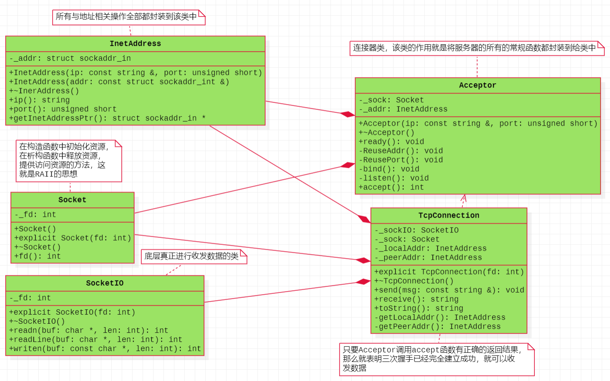

#### 3、常用函数

```C++
ssize_t recv(int sockfd, void *buf, size_t len, int flags);
//如果第四个参数flags为0，那么recv与read是完全等价的。但是如果flags为MSG_PEEK，那么会将内核缓冲区中的数据拷贝出来，而不会移除。

#include <sys/socket.h>
int getsockname(int sockfd, struct sockaddr *addr, socklen_t *addrlen);
//通过文件描述符sockfd获取本端的地址addr

int getpeername(int sockfd, struct sockaddr *addr, socklen_t *addrlen);
//通过文件描述符sockfd获取对端的地址addr
```

### 二、ReactorV2

#### 1、伪代码

```C++
void EventLoop::loop()
{
    _isLooping = true;
    while(_isLooping)
    {
        waitEpollFd();
    }
}

void EventLoop::uploop()
{
    _isLooping = false;
}

void EventLoop::waitEpollFd()
{
    nready = epoll_wait();
    if(-1 == nready && errno == EINTR )
    {
        continue;
    }
    else if(-1 == nready)
    {
        cerr;
        return;
    }
    else if(0 == nready)
    {
        cout << "超时" << endl;
    }
    else
    {
        for(size_t idx = 0; idx < nready; ++idx)
        {
            if(文件描述符 == listenfd)
            {
                //处理新的连接请求
                handleNewConnection();
            }
            else
            {
                //可以老的连接上的数据的收发
                handleMessage();
            }
        }
    }
}

void EventLoop::handleNewConnection()
{
    int connfd = _acceptor.accept();
    
    //将文件描述符connfd放在红黑树上进行监听
    addEpollReadFd(connfd);
    
    //创建出连接
    TcpConnection con(connfd);
    
    //将文件描述符与连接存放在map中
    _conns.insert(connfd, TcpConnection);   
}

void EventLoop::handleMessage(int fd)
{
    auto it = _conns.find(fd);
    if(it != _conns.end())
    {
        //连接是存在的
        //接受数据
        msg = it->second->receive();
        //发送数据
        it->second->send(msg);
    }
    else
    {
        //连接是不存在的
    }
}
```

#### 2、三个半事件

TCP网络编程最本质的是处理三个半事件：

**连接建立**：包括服务器端被动接受连接（accept）和客户端主动发起连接（connect）。TCP连接一旦建立，客户端和服务端就是平等的，可以各自收发数据。
**连接断开**：包括主动断开（close、shutdown）和被动断开（read()返回0）。
**消息到达**：文件描述符可读。这是最为重要的一个事件，对它的处理方式决定了网络编程的风格（阻塞还是非阻塞，如何处理分包，应用层的缓冲如何设计等等）。
消息发送完毕：这算半个。对于低流量的服务，可不必关心这个事件；另外，这里的“发送完毕”是指数据写入操作系统缓冲区（内核缓冲区），将由TCP协议栈负责数据的发送与重传，不代表对方已经接收到数据。

#### 3、类图

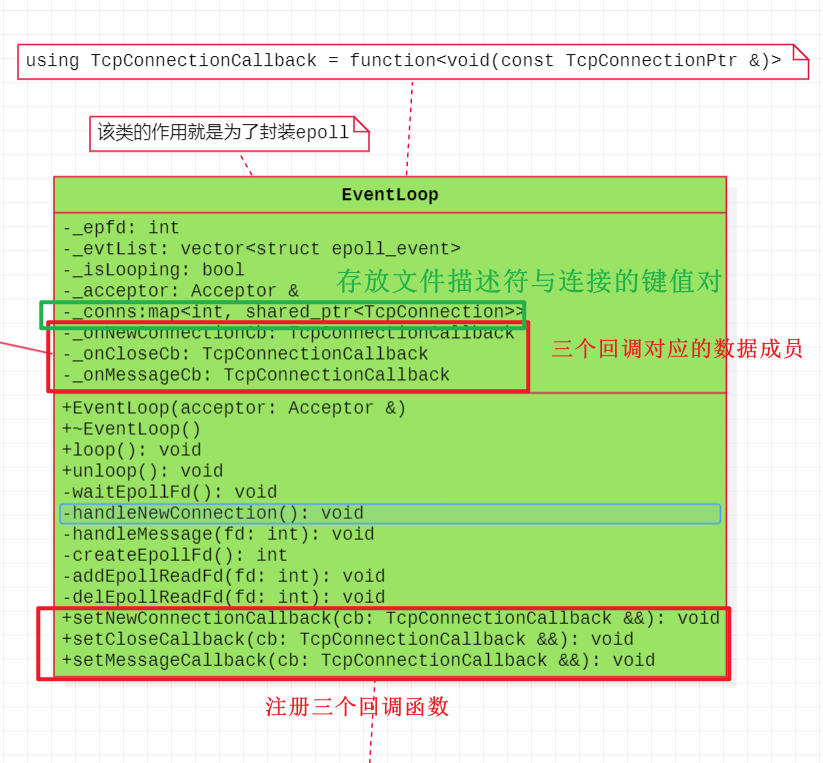


#### 4、添加三个半事件（回调）

Tcp网络编程中有三个半事件，但是我们只关注其中的前三个，即：**连接建立、消息到达、连接断开**。三个事件都是与连接相关的，也就是与TcpConnection相关，这三个事件可以使用**回调机制**的形式进行，也就是回调函数的注册与回调函数的执行，但是现在TcpConnection对象的创建在EventLoop中，所以三个事件需要先传递给EventLoop，再交给TcpConnection，而在C++中，回调函数可以使用bind与function结合使用，也就是function可以绑定函数类型，而现在每个事件都与连接相关，所以就是`function<void(const TcpConnectionPtr &)>`,也就是可以将其改名，`using TcpConnectionCallback = function<void(const TcpConnectionPtr &)>`.然后就是EventLoop注册三个回调函数，并且作为桥梁传递给TcpConnection对象，但是EventLoop不会执行该回调函数，因为三个事件的执行只与TcpConnection连接相关，与EventLoop没有关系。最后的结果是，在TcpConnection与EventLoop都注册三个回调函数与设置三个数据成员，但是只有TcpConnection中有三个回调函数的执行。

#### 5、核心代码的解析

##### 5.1、EventLoop中键值对存储

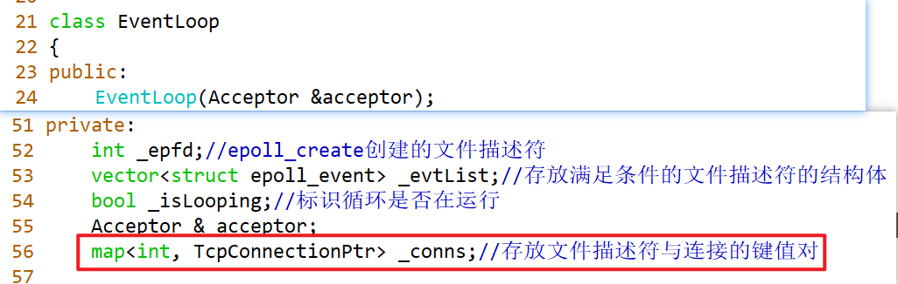

##### 5.2、EventLoop中三个回调的存储

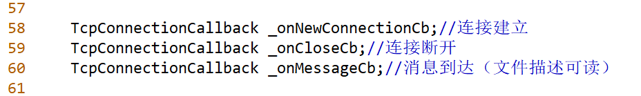

##### 5.3、EventLoop中三个回调的注册


##### 5.4、TcpConnection中三个回调的存储

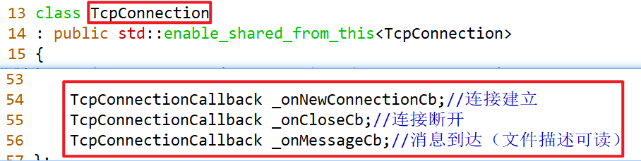

##### 5.5、TcpConnection中三个回调的注册

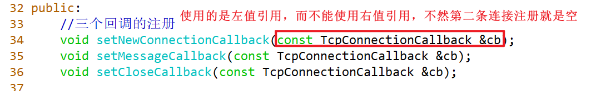

##### 5.6、TcpConnection中三个回调的执行


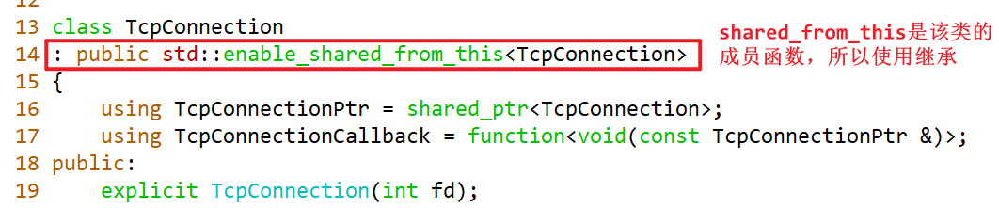

##### 5.7、EventLoop中epoll_wait参数问题


##### 5.8、EventLoop中处理新的连接请求

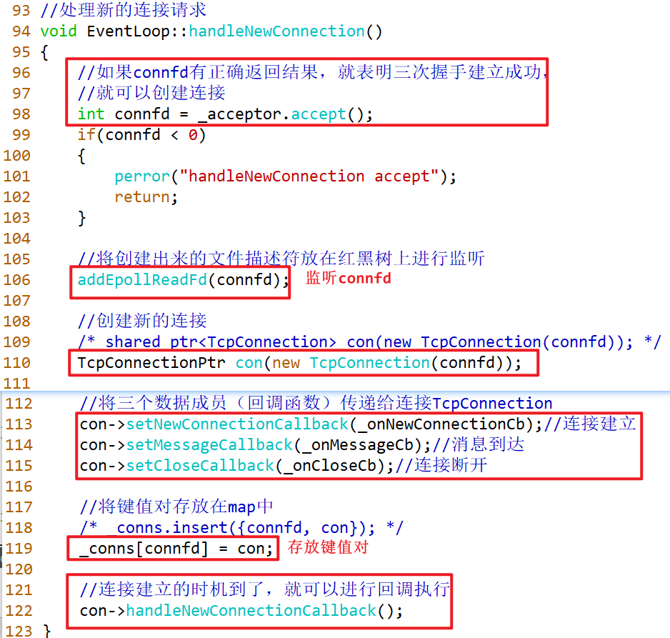

##### 5.9、EventLoop中老的连接上数据的收发

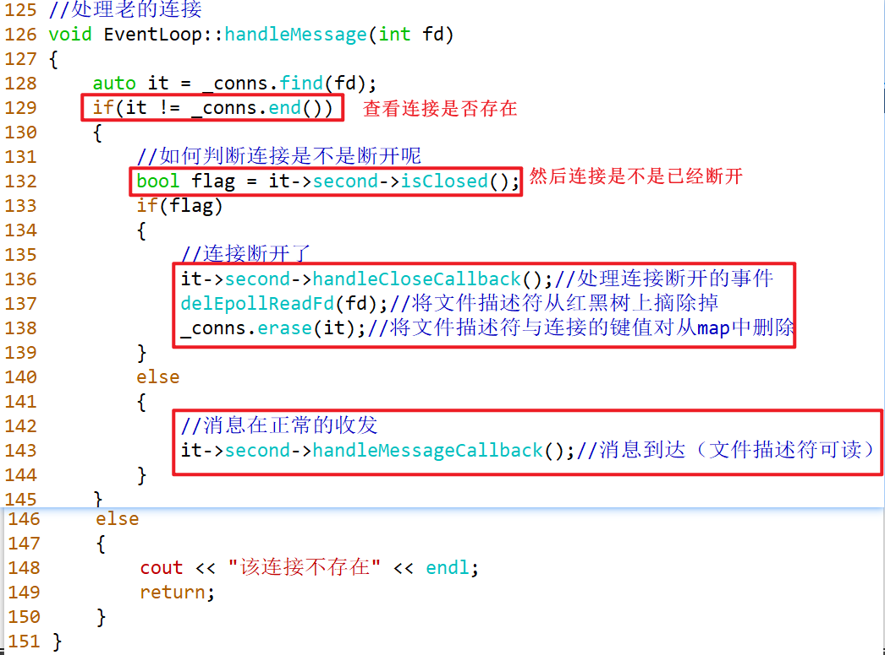

#### 6、代码流程

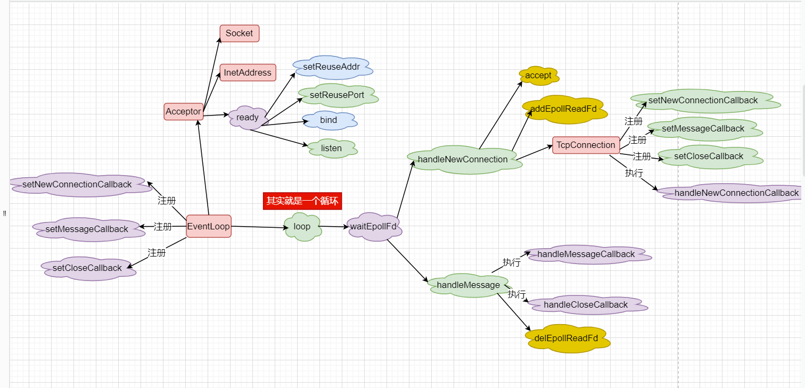

### 三、ReactorV3

#### 1、类图

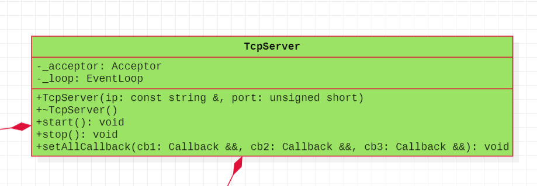

### 四、eventfd的使用

#### 1、特点

它的主要是用于**进程或者线程间**通信(如通知/等待机制的实现)。

#### 2、接口

```C++
#include <sys/eventfd.h>
int eventfd(unsigned int initval, int flags);
//initval:是由内核计数器维护的一个初始值。
//flags:标志位，可以设置为0.也可以是EFD_NONBLOCK或EFD_CLOEXEC
//返回值：返回一个文件描述符，该文件描述符可以进行读写与监听（IO多路复用）
```

#### 3、进程之间进行通信


## 1、实现一个自定义的String类，保证main函数对正确执行

```c++
class String
{
public:
	String();
	String(const char *pstr);
	String(const String & rhs);
	String & operator=(const String & rhs);
	~String();

	void print();

private:
	char * _pstr;
};

int main(void)
{
	String str1;
	str1.print();
	
	String str2 = "Hello,world";
	String str3("wangdao");
	
	str2.print();		
	str3.print();	
	
	String str4 = str3;
	str4.print();
	
	str4 = str2;
	str4.print();
	
	return 0;
}
```

## 2、编写一个类，实现简单的栈。栈中有以下操作：

```c++
元素入栈     void push(int);
元素出栈     void pop();
读出栈顶元素 int top();
判断栈空     bool emty();
判断栈满     bool full();
如果栈溢出，程序终止。栈的数据成员由存放
10个整型数据的数组构成。先后做如下操作：
创建栈
将10入栈
将12入栈
将14入栈
读出并输出栈顶元素
出栈
读出并输出栈顶元素
```


## 3、编写一个类，实现简单的队列。队列中有以下操作：

```c++
元素入队            void push(int);
元素出队            void pop();
读取队头元素         int front();
读取队尾元素         int back();
判断队列是否为空     bool emty();
判断队列是否已满     bool full();
```

## 5. 统计一篇英文(The_Holy_Bible.txt)文章中出现的单词和词频

```c++
输入：某篇文章的绝对路径
输出：词典（词典中的内容为每一行都是一个“单词 词频”）

词典的存储格式如下
-----------------
|   a 66          |
|   abandon 77    |
|   public 88     |
|    ......	      |
|_________________|

struct Record
{
	string _word;
	int _frequency;
};

class Dictionary
{
public:
	//......
    void read(const std::string &filename);
    void store(const std::string &filename);
private:
	vector<Record> _dict;
};
```

## 6. 封装log4cpp,使用起来比较方便，如下所示

```c++
输出的日志信息能同时输出到终端和文件

int main(void)
{
    cout << "hello,world"<<endl;

    logInfo("Message");	//或者   
    logError("Message");
    logWarn("Message");
    logDebug("Message");
}

加分项：输出的日志信息中最好能有文件的名字，函数的名字及其所在的行号

//使用单例模式
class Mylogger
{
public:
    void warn(const char * msg);
    void error(const char * msg);
    void debug(const char * msg);
    void info(const char * msg);
private:
    Mylogger();
    ~Mylogger();
private:
    //......
};

Mylogger * log = Mylogger::getInstance();
log->warn("hello");
```

## 7、实现String类的其它运算符的重载

```c++
class String 
{
public:
	String();
	String(const char *);
	String(const String&);
	~String();
	String &operator=(const String &);
	String &operator=(const char *);

	String &operator+=(const String &);
	String &operator+=(const char *);
	
	char &operator[](std::size_t index);
	const char &operator[](std::size_t index) const;
	
	std::size_t size() const;
	const char* c_str() const;
	
	friend bool operator==(const String &, const String &);
	friend bool operator!=(const String &, const String &);
	
	friend bool operator<(const String &, const String &);
	friend bool operator>(const String &, const String &);
	friend bool operator<=(const String &, const String &);
	friend bool operator>=(const String &, const String &);
	
	friend std::ostream &operator<<(std::ostream &os, const String &s);
	friend std::istream &operator>>(std::istream &is, String &s);

private:
	char * _pstr;
};

String operator+(const String &, const String &);
String operator+(const String &, const char *);
String operator+(const char *, const String &);
```

## 8. 实现COW的String，让其operator[]能够区分出读写操作

## 9.使用tinyXml2解析RSS文件，并生成一个网页库pagelib.dat

tinyXml2 -- https://github.com/leethomason/tinyxml2

rss      --   https://coolshell.cn/feed

--   http://www.runoob.com/rss/rss-tutorial.html

```c++
正则表达式 进行过滤
参考接口:   
struct RssItem
{
    string title;
    string link;
    string description;
    string content;
};

class RssReader
{
public:
    RssReader();
    void parseRss();//解析
    void dump(const string & filename);//输出
private:
    vector<RssItem> _rss;
};   

要求：最后生成一个 pagelib.txt, 其格式:
```

```c++
    <doc>
      <docid>1</docid>
      <title> ... </title>
      <link> ...  </link>
      <content> ... </content>
    </doc>
    <doc>
      ...
    </doc>
    <doc>
      ...
    </doc>
```

```c++
RSS文件解析作业思路：                 
xml -->  rss --> tinyxml2 --> boost::regex/std::regex
```

## 10. 词频统计的作业再用map容器去实现一次

体验一下使用vector/map时程序执行的速度++dict[word];

## 11. 文本查询

```c++
该程序将读取用户指定的任意文本文件【当前目录下的china_daily.txt】，
然后允许用户从该文件中查找单词。查询的结果是该单词出现的次数，并列
出每次出现所在的行。如果某单词在同一行中多次出现，程序将只显示该行
一次。行号按升序显示。

要求：
a. 它必须允许用户指明要处理的文件名字。

b. 程序将存储该文件的内容，以便输出每个单词所在的原始行。
vector<string> lines;//O(1) 

c. 它必须将每一行分解为各个单词，并记录每个单词所在的所有行。 
在输出行号时，应保证以升序输出，并且不重复。 

map<string, set<int> > wordNumbers;
map<string, int> dict;

d. 对特定单词的查询将返回出现该单词的所有行的行号。

e. 输出某单词所在的行文本时，程序必须能根据给定的行号从输入
文件中获取相应的行。

示例：
使用提供的文件内容，然后查找单词 "element"。输出的前几行为:
---------------------------------------------
element occurs 125 times.
(line 62) element with a given key.
(line 64) second element with the same key.
(line 153) element |==| operator.
(line 250) the element type.
(line 398) corresponding element.
---------------------------------------------	

程序接口[可选]:
class TextQuery
{
public:
    //......
    void readFile(const string filename);
    //void query(const string & word);//查询和打印耦合在一起了
    QueryResult query(const string & word);
private:
    //......
    vector<string> _lines;//O(1) 
    map<string, set<int> > _wordNumbers;
    map<string, int> _dict;//
};

void print(ostream & os, const QueryResult &);

//程序测试用例
int main(int argc, char *argv[])
{
    string  queryWord("hello");

    TextQuery tq;
    tq.readFile("test.dat");
    tq.query(queryWord);			   
    return 0;
} 
```

## 12. 两个作业：文本查询扩展(必做)与魔兽世界3750(选做)

12、(必做)完成C++ primer(第5版)中的15.9节的文本查询程序扩展

即使不自己实现,最好也要照着书敲一遍代码, 在机器上让程序跑起来.

12.1、(选做)魔兽世界3750: http://bailian.openjudge.cn/practice/3750/

## 13、将day13作业中的编程题第3题（文本查询作业）用智能指针的方式再实现一遍，

可以参考C++ Primer 第5版第12章3小节（12.3）的实现

## 14. 实现一个模板形式的单例类

要求对于任意类型的类经过Singleton的处理之后，都能获取一个单例对象，并且可以传递任意参数
    

```c++
class Point;
class Computer;

Point pt(1, 2);
Point pt2(3, 4);

Computer com("Mac", 8888);


int main(void)
{
    Computer * p1 = Singleton<Computer>::getInstance("Xiaomi", 6666);
    Computer * p2 = Singleton<Computer>::getInstance("Xiaomi", 6666);

    Point　* p3 = Singleton<Point>::getInstance(1, 2);
    Point　* p4 = Singleton<Point>::getInstance(1, 2);

    Point3D　* p5 = Singleton<Point>::getInstance(1, 2, 3);

    return 0;
} 
```

## 15. 实现log4cpp的封装，使其可以像printf一样使用

测试用例如下:

```c++
void test() {
    int number = 100;
    const char * pstr = "hello, log4cpp";
    LogError("this is an info message. number = %d, str = %s\n", number, pstr);
}
```

## 16. Leetcode 20题（见leetcode或word文档）未实现

## 17. Leetcode 127题（见leetcode或word文档）未实现

## 18. 使用模板实现一个堆排序算法   未实现

使用模板的框架如下：

```c++
template <typename T, typename Compare = std::less<T> >
class HeapSort
{
public:
    HeapSort(T * arr, int size);        
    void heapAdjust();
    void sort();
private:
    //...
};
```

## 19. 使用模板实现一个快速排序算法 

## 20. Leetcode 146 LURCache的实现（见leetcode或word文档）

## 21.使用unordered_map/map实现单词转换程序。

给定一个string，将它转换为另一个string。程序的输入是两个文件，第一个文件保存的是一些规则，用来转换第二个文件中的文本。每条规则由两部分组成：一个可能出现在输入文件中的单词和一个用来替换它的短语。表达的含义是，每当第一个单词出现在输入中时，我们就将它替换为对应的短语，第二个输入文件包含要转换的文本。（C++ primer 11.3.6）

提示：
规则文件：map.txt文件，其实就是第一个单词，被后面的一串所替换。
待转换文本：file.txt文件，该文件中的单词如果出现在map.txt文件的第一个单词的话，就用map.txt的后面一串替代。

结果：最后结果其实就是，将file.txt文件中的并且出现在map.txt中第一个单词转换为map.txt后面的一串。例如：where r u的输出结果就是where are you.   r替换为are，u替换为you

```txt
//file.txt
where r u
y dont u send me a pic
k thk l8r
    
//map.txt
brb be right back
k okay?
y why
r are
u you
pic picture
thk thanks!
l8r later 
```

## 22. 了解std::allocator的用法之后,实现自定义的Vector类

接口形式：

```c++
template<typename T>
class Vector
{
public:
    Vector();
    ~Vector();

    void push_back(const T &); 
    void pop_back();    

    int size();
    int capacity();
private:
    void reallocate();//重新分配内存,动态扩容要用的
private:    
    static std::allocator<T> _alloc;

    T * _start;      //指向数组中的第一个元素
    T * _finish; //指向最后一个实际元素之后的那个元素
    T * _end_of_storage;        //指向数组本身之后的位置
};
```

```txt
Vector模型
______________________________
|_|_|_|_|_|____________________|
↑         ↑                    ↑
_start   _finish            _end_of_storage
```

## 编程题答案

### 1、String的实现

```c++
/* String.cc */
#include <string.h>
#include <iostream>

using std::cout;
using std::endl;

//面试的题目
class String
{
public:
    String()
    : _pstr(nullptr)
    {
        cout << "String()" << endl;
    }
    String(const char *pstr)
    : _pstr(new char[strlen(pstr) + 1]())
    {
        cout << "String(const char *)" << endl;
        strcpy(_pstr, pstr);
    }

    String(const String & rhs)
    : _pstr(new char[strlen(rhs._pstr) + 1]())
    {
        cout << "String(const String &)" << endl;
        strcpy(_pstr, rhs._pstr);
    }

    String & operator=(const String & rhs)
    {
        cout << "String &operator=(const String &)" << endl;
        //1、自复制
        if(this != &rhs)
        {
            //2、释放左操作数
            if(_pstr)
            {
                delete [] _pstr;
                _pstr = nullptr;
            }

            //3、深拷贝
            /* if(rhs._pstr) */
            _pstr = new char[strlen(rhs._pstr) + 1]();
            strcpy(_pstr, rhs._pstr);
        }
        //4、返回*this
        return *this;
    }

    size_t length() const
    {
        size_t len = 0;
        if(_pstr)
        {
            len = strlen(_pstr);
        }

        return len;

    }

    const char * c_str() const
    {
        if(_pstr)
        {
            return _pstr;
        }
        else
        {
            return nullptr;
        }
    }


    ~String()
    {
        cout << "~String()" << endl;
        if(_pstr)
        {
            delete [] _pstr;
            _pstr = nullptr;
        }
    }

    void print() const
    {
        if(_pstr)
        {
            cout << "_pstr = " << _pstr << endl;
        }
    }

private:
    char * _pstr;
};

int main(void)
{
    String str1;
    str1.print();

    cout << endl << endl;
    //C++         C,"Hello,world"===>String("Hello,world")
    String str2 = "Hello,world";
    String str3("wangdao");

    str2.print();		
    str3.print();	

    cout << endl << endl;
    String str4 = str3;
    str4.print();

    cout << endl << endl;
    str4 = str2;
    str4.print();

    //从C++风格字符串转换为C风格字符串
    const char *pstr = str3.c_str();

    return 0;
}
```

### 2、栈的实现

```c++
#include <iostream>

using std::cout;
using std::endl;

class Stack
{
public:
    Stack(int size = 10)
    : _size(size)
    , _top(-1)
    , _data(new int[_size]())
    {
        cout << "Stack(int  = 10)" << endl;
    }

    ~Stack()
    {
        cout << "~Satck()" << endl;
        if(_data)
        {
            delete [] _data;
            _data = nullptr;
        }
    }

    bool full() const
    {
#if 0
        if(_top == _size - 1)
        {
            return true;
        }
        else
        {
            return false;
        }
#endif

        return (_top == _size - 1);
    }

    bool empty() const
    {
        return (-1 == _top);
        /* return ( _top = -1); */
    }

    void push(const int &value)
    {
        if(!full())
        {
            _data[++_top] = value;
        }
        else
        {
            cout << "The stack is full" << endl;
            return;
        }
    }
    void pop()
    {
        if(!empty())
        {
            --_top;
        }
        else
        {
            cout << "The stack is empty" << endl;
            return;
        }
    }
    int top() const
    {
        return _data[_top];
    }
private:
    int _size;
    int _top;
    int *_data;
};

int main(int argc, char **argv)
{
    Stack st(12);
    cout << "栈是不是空的？" << st.empty() << endl;
    st.push(1);
    cout << "栈是不是满的？" << st.full() << endl;

    for(int idx = 2; idx != 15; ++idx)
    {
        st.push(idx);
    }

    while(!st.empty())
    {
        cout << st.top() << endl;
        st.pop();
    }
    cout << "栈是不是空的？" << st.empty() << endl;
    return 0;
}
```

### 5、词频统计vector

```c++
/* dictVector.cc */
#include <iostream>
#include <string>
#include <vector>
#include <fstream>
#include <sstream>

using std::cout;
using std::endl;
using std::cerr;
using std::string;
using std::vector;
using std::ifstream;
using std::ofstream;
using std::istringstream;

struct Record
{
    Record(const string &word, int frequency)
    : _word(word)
    , _frequency(frequency)
    {

    }
	string _word;
	int _frequency;
};

class Dictionary
{
public:
    Dictionary(int capa)
    {
        _dict.reserve(capa);//预留空间
    }

    void read(const string &filename)
    {
        ifstream ifs(filename);
        if(!ifs.good())
        {
            cerr << "open " << filename << " error" << endl;
            return;
        }
        //读filename这个文件，然后对每一个单词做处理
        string line;
        while(getline(ifs, line))
        {
            //字符串IO
            istringstream iss(line);
            string word;
            while(iss >> word)
            {
                //word一定是最终要保存的单词吗？hello!  1
                string newWord = dealWord(word);//对老的单词做处理，得到新的单词
                insert(newWord);//将满足条件的单词存在vector中
            }
        }

        ifs.close();
    }

    void store(const string &filename)
    {
        ofstream ofs(filename);
        if(!ofs.good())
        {
            cerr << "open " << filename << " error!" << endl;
            return;
        }

        for(size_t idx = 0; idx != _dict.size(); ++idx)
        {
            ofs << _dict[idx]._word << "      " 
                << _dict[idx]._frequency << endl;
        }

        ofs.close();
    }

    string dealWord(const string &word)
    {
        for(size_t idx = 0; idx != word.size(); ++idx)
        {
            //word!
            /* if((word[idx] >= 'a'&& word[idx] <= 'z') || (word[idx] >= 'A'&& word[idx] <= 'Z')) */
            if(!isalpha(word[idx]))
            {
                return string();//临时对象
            }
        }

        return word;
    }

    void insert(const string &word)
    {
        //判断空串
        if(word == string())
        {
            return ;
        }

        size_t idx = 0;
        for(idx = 0; idx != _dict.size(); ++idx)
        {
            if(word == _dict[idx]._word)
            {
                ++_dict[idx]._frequency;//频率进行++
                break;
            }
        }

        if(idx == _dict.size())
        {
            _dict.push_back(Record(word, 1));//单词第一次出现的代码
        }
    }

private:
	vector<Record> _dict;
};

int main(int argc, char **argv)
{
    Dictionary dictionary(13000);
    cout << "begin reading..." << endl;
    dictionary.read("The_Holy_Bible.txt");
    cout << "end reading..." << endl;
    dictionary.store("dict.dat");
    return 0;
}
```

### 7、String运算符重载

```c++
/* stringOperator.cc */
#include <string.h>
#include <iostream>
#include <vector>

using std::cout;
using std::endl;
using std::vector;

class String 
{
public:
    String()
   // : _pstr(nullptr)//后面操作的时候，需要判空
	: _pstr(new char[1]())
    {
        cout << "String()" << endl;
    }

    //String s1("hello")
    //String s1 = "hello";//String("hello")
    //"hello"=====String("hello")
    String(const char *pstr)
    : _pstr(new char[strlen(pstr) + 1]())
    {
        cout << "String(const char *)" << endl;
        strcpy(_pstr, pstr);
    }

    //String s2(s1);
    //String s2 = s1;
    String(const String &rhs)
    : _pstr(new char[strlen(rhs._pstr) +1]())
    {
        cout << "String(const String &)" << endl;
        strcpy(_pstr, rhs._pstr);
    }

    ~String()
    {
        cout << "~String()" << endl;
        if(_pstr)
        {
            delete [] _pstr;
            _pstr = nullptr;
        }
    }

    //String s1;
    //s1 = s1;
    String &operator=(const String &rhs)
    {
        cout << "String &operator=(const String &)" << endl;
        if(this != &rhs)
        {
            delete [] _pstr;
            _pstr = nullptr;

            _pstr = new char[strlen(rhs._pstr) + 1]();
            strcpy(_pstr, rhs._pstr);
        }
        return  *this;
    }

    // s1 = "hello";增量开发
    String &operator=(const char *pstr)
    {
        cout << "String &operator=(const char *)" << endl;
        String tmp(pstr);
        *this = tmp;

        return *this;
    }

    //s1 += s2;
    String &operator+=(const String &rhs)
    {
        cout << "String &operator+=(const String &)" <<endl;
        String tmp;
        if(tmp._pstr)
        {
            delete [] tmp._pstr;//防止内存泄漏
        }
        tmp._pstr = new char[strlen(_pstr) + 1]();
        strcpy(tmp._pstr, _pstr);
        delete [] _pstr;
        _pstr = nullptr;
        _pstr = new char[strlen(rhs._pstr) + strlen(tmp._pstr) + 1]();
        strcpy(_pstr, tmp._pstr);
        strcat(_pstr, rhs._pstr);

        return *this;
    }

    //s1 += "hello"
    String &operator+=(const char *pstr)
    {
        cout << "String &operator+=(const char *)" << endl;
        String tmp(pstr);
        *this += tmp;

        return *this;
    }

    //const String s1("helo");
    //s1[0]
    char &operator[](std::size_t index)//index > = 0
    {
        if(index < size())
        {
            return _pstr[index];
        }
        else
        {
            static char nullchar = '\0';
            return nullchar;
        }
    }

    const char &operator[](std::size_t index) const
    {
        if(index < size())
        {
            return _pstr[index];
        }
        else
        {
            static char nullchar = '\0';
            return nullchar;
        }

    }

    std::size_t size() const
    {
        return strlen(_pstr);
    }

    const char* c_str() const
    {
        return _pstr;
    }

    friend bool operator==(const String &, const String &);
    friend bool operator!=(const String &, const String &);

    friend bool operator<(const String &, const String &);
    friend bool operator>(const String &, const String &);
    friend bool operator<=(const String &, const String &);
    friend bool operator>=(const String &, const String &);

    friend std::ostream &operator<<(std::ostream &os, const String &s);
    friend std::istream &operator>>(std::istream &is, String &s);

private:
    char * _pstr;
};

bool operator==(const String &lhs, const String &rhs)
{
    return !strcmp(lhs._pstr, rhs._pstr);
}

bool operator!=(const String &lhs, const String &rhs)
{
    return strcmp(lhs._pstr, rhs._pstr);
}

bool operator<(const String &lhs, const String &rhs)
{
    return strcmp(lhs._pstr, rhs._pstr) < 0;
}

bool operator>(const String &lhs, const String &rhs)
{
    return strcmp(lhs._pstr, rhs._pstr) > 0;
}
bool operator<=(const String &lhs, const String &rhs)
{
    return strcmp(lhs._pstr, rhs._pstr) <= 0;
}
bool operator>=(const String &lhs, const String &rhs)
{
    return strcmp(lhs._pstr, rhs._pstr) >= 0;
}

std::ostream &operator<<(std::ostream &os, const String &rhs)
{
    if(rhs._pstr)
    {
        os << rhs._pstr;
    }

    return os;
}

//String s1("hello")
//cin >> s1;
std::istream &operator>>(std::istream &is, String &rhs)
{
    if(rhs._pstr)
    {
        delete [] rhs._pstr;
        rhs._pstr = nullptr;
    }

    //动态获取从键盘输入数据的长度
    vector<char> buffer;
    char ch;
    while((ch = is.get()) != '\n')
    {
        buffer.push_back(ch);
    }

    rhs._pstr = new char[buffer.size() + 1]();
    strncpy(rhs._pstr, &buffer[0], buffer.size());

    return is;
}

String operator+(const String &lhs, const String &rhs)
{
    cout << "String operator+(const String &, const String &)" << endl;

    String tmp(lhs);
    tmp += rhs;

    return tmp;
}
//s1 + "hello"
String operator+(const String &lhs, const char *pstr)
{
    cout << "String operator+(const String &, const char *)"<< endl;
    String tmp(lhs);
    tmp += pstr;

    return tmp;

}

//"hello" + s1
String operator+(const char *pstr, const String &rhs)
{
    cout << "String operator+(const char*, const String &)" << endl;
    String tmp(pstr);
    tmp += rhs;

    return tmp;
}


void test()
{
    String s1;
    /* std::cin >> s1; */
    cout << "s1 = " << s1 << endl;

    cout << endl << endl;
    String s2 = "hello";
    cout << "s2 = " << s2 << endl;

    cout << endl << "1111" <<  endl;
    s2 = "world"; //error
    cout << "s2 = " << s2 << endl;

    cout << endl << endl;
    s2 = s2;
    cout << "s2 = " << s2 << endl;

    cout << endl << endl;
    String s3 = "wuhan";
    s3 += " welcome to string word";
    cout << "s3 = " << s3 << endl;
}

int main(int argc, char **argv)
{
    test();
    return 0;
}
```

### 10、词频统计map与vector

map：

```c++
#include <time.h>
#include <iostream>
#include <string>
#include <fstream>
#include <sstream>
#include <map>
#include <utility>

using std::endl;
using std::cerr;
using std::cout;
using std::string;
using std::ifstream;
using std::ofstream;
using std::istringstream;
using std::map;
using std::pair;

class Dictionary
{
public:
    void read(const string &filename)
    {
        ifstream ifs(filename);
        if(!ifs)
        {
            cerr << "ifs open " << filename << " error!" << endl;
            return;
        }

        string line;
        while(getline(ifs, line))
        {
            istringstream iss(line);
            string word;
            while(iss >> word)
            {
                string newWord = dealWord(word);
                if(string() != newWord)
                {
                    ++_map[newWord];
                }
            }
        }

        ifs.close();
    }

    void store(const string &filename)
    {
        ofstream ofs(filename);
        if(!ofs)
        {
            cerr << "ofs open " << filename << " error!" << endl;
            return;
        }

        map<string, int>::iterator it;
        for(it = _map.begin(); it != _map.end(); ++it)
        {
            ofs << it->first << "  " << it->second << endl;
        }

        ofs.close();
    }
private:
    string dealWord(const string &word)
    {
        //查看获取到的字符串是不是单词：标点符号，true1都不算
        for(size_t idx = 0; idx != word.size(); ++idx)
        {
            if(!isalpha(word[idx]))
            {
                //如果存在标点，数字等不算单词，返回空串
                return string();
            }
        }

        //转换为合理的单词
        return word;
    }

private:
    map<string, int> _map;
};

int main(void)
{
    cout << "before reading..." << endl;
    Dictionary dictionary;
    time_t beg = time(NULL);
    dictionary.read("The_Holy_Bible.txt");
    time_t end = time(NULL);
    cout << "time: " << (end - beg) << "s" << endl;
    cout << "aftre reading..." << endl;
    dictionary.store("dictMap.dat");
    return 0;
}
```

vector：

```c++
#include <time.h>
#include <iostream>
#include <string>
#include <vector>
#include <fstream>
#include <sstream>
#include <algorithm>

using std::cout;
using std::cerr;
using std::endl;
using std::string;
using std::vector;
using std::ifstream;
using std::ofstream;
using std::istringstream;
using std::sort;

struct Record
{
    Record(const string &word, int frequency)
    : _word(word)
    , _frequency(frequency)
    {
    }

    string _word;
    int _frequency;
};

bool operator<(const Record &lhs, const Record &rhs)
{
    return lhs._word < rhs._word;
}

class Dictionary
{
public:
    Dictionary(int capa)
    {
        _dict.reserve(capa);
    }

    void read(const string &filename)
    {
        ifstream ifs(filename);
        if(!ifs)//bool operator!(){}  operator bool() {}
        {
            //cout cerr clog
            cerr << "ifs open file " << filename << " error!" << endl;
            return;
        }

        string line;
        //while(ifs >> word)
        while(getline(ifs, line))
        {
            istringstream iss(line);//串IO，内存
            string word;

            //vector<Point> pt = {Point(1, 2), {3, 4}, (5, 6)};
            //逗号表达式
            while(iss >> word, !iss.eof())//word可能就是不规范abc123
            /* while(iss >> word)//word可能就是不规范abc123,while(真值表达式) iss  ---> bool /int */
            {
                //newWord是处理之后的新单词
                string newWord = dealWord(word);

                //把新的单词插入到vector里面
                insert(newWord);
            }
        }

        //将元素进行排序
        sort(_dict.begin(), _dict.end());

        ifs.close();
    }

    //将单词与词频存储到文件中
    void store(const string &filename)
    {
        ofstream ofs(filename);
        if(!ofs)
        {
            cerr << "ofs open " << filename << " error" << endl;
            return;
        }

        for(size_t idx = 0; idx != _dict.size(); ++idx)
        {
            ofs << _dict[idx]._word << "   " 
                << _dict[idx]._frequency << endl;
        }

        ofs.close();
    }

    //对不符合要求的单词进行处理
    string dealWord(const string &word)
    {
        for(size_t idx = 0; idx != word.size(); ++idx)
        {
            //if(word[idx] > 'A')
            if(!isalpha(word[idx]))
            {
                return string();//以空串进行替换
            }
        }

        return word;
    }

    //把结果插入到vector中
    void insert(const string &word)
    {
        if(word == string())
        {
            return;
        }

        size_t idx = 0;
        for(idx = 0; idx != _dict.size(); ++idx)
        {
            if(word == _dict[idx]._word)
            {
                ++_dict[idx]._frequency;
                break;//记得写上
            }
        }

        if(idx == _dict.size())
        {
            _dict.push_back(Record(word, 1));
        }
    }

private:
    vector<Record> _dict;
};

int main(int argc, char **argv)
{
    Dictionary dictionary(13000);
    cout << "before reading..." << endl;
    time_t beg = time(NULL);
    dictionary.read("The_Holy_Bible.txt");
    time_t end  = time(NULL);
    cout << "time : " << (end - beg) << "s" << endl;
    cout << "after reading..." << endl;
    dictionary.store("dictVector.dat");
    return 0;
}
```

### 11、文本查询

```c++
/* TextQuery.cc */
#include <iostream>
#include <string>
#include <fstream>
#include <sstream>
#include <vector>
#include <map>
#include <set>

using std::cout;
using std::endl;
using std::cin;
using std::ifstream;
using std::istringstream;
using std::vector;
using std::set;
using std::map;
using std::string;

class TextQuery
{
public:
    //构造函数先分配一定空间的大小
    TextQuery()
    {
        _file.reserve(100);
    }

    void readFile(const string &filename);
    void query(const string &word);

private:
    void preProceccLine(string &line);

private:
    //每次获取一行并存起来
    vector<string> _file;
    //单词以及词频
    map<string, int> _dict;
    //单词以及所在行号(注意：同一个单词在相同行出现，只记录一次)
    map<string, set<int>> _word2line;
};

void TextQuery::readFile(const string &filename)
{
    ifstream ifs(filename);
    if(!ifs)
    {
        cout << "ifstream open " << filename << " error!" << endl;
        return;
    }

    string line;
    size_t lineNumber = 0;
    while(getline(ifs, line))
    {
        //读一行，并将结果存在vector中(对单词处理前就存起来，存的是原始的)
        _file.push_back(line);

        //对读取行的单词进行处理
        preProceccLine(line);

        istringstream iss(line);
        string word;
        while(iss >> word)
        {
            //统计单词与词频
            ++_dict[word];

            //将单词所在的行记录下来
            _word2line[word].insert(lineNumber);
        }

        ++lineNumber;
    }

    ifs.close();
}

void TextQuery::query(const string &word)
{
    int count = _dict[word];//获取单词出现的次数
    cout << word << " occurs " << count << (count > 1 ? " times" : " time.") << endl;//打印单词次数

    auto lines = _word2line[word];//对同一个单词出现的行进行遍历，输出单词以及行号
    for(auto &number : lines)
    {
        cout << "    (line " << number + 1 << ") " << _file[number] << endl;
    }
}

void TextQuery::preProceccLine(string &line)
{
    for(auto &ch : line)
    {
        if(!isalpha(ch))//处理单词，如果不是字母就用空格代替abc? abc123 Hello
        {
            ch = ' ';
        }
        else if(isupper(ch))//如果是大写就转为小写,Hello
        {
            ch = tolower(ch);
        }
    }
}

int main(int argc, char **argv)
{
    TextQuery tq;
    tq.readFile("china_daily.txt");
    cout << " please input a query word: " << endl;
    string word;
    while(cin >> word)
    {
        tq.query(word);
    }

    return 0;
}
```


